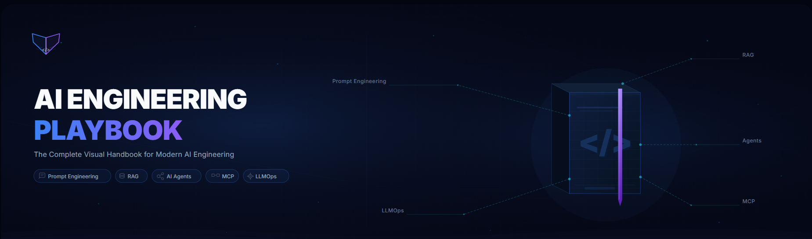

<div align="center">



<br>

# AI Engineering Playbook

### The Complete Visual Handbook for Modern AI Engineering

Learn Prompt Engineering, RAG, AI Agents, MCP, Model Context Protocol (MCP), LLMOps, Retrieval-Augmented Generation, and production-ready AI systems.

<p>


</p>

<p>

<a href="#-learning-roadmap">Roadmap</a> • <a href="#-documentation">Documentation</a> • <a href="#-contributing">Contributing</a> • <a href="./ROADMAP.md">Project Roadmap</a>

</p>

⭐ **If this repository helps you, consider giving it a star!**

</div>

---

# 📖 About

Modern AI is evolving rapidly.

Instead of collecting hundreds of random links, **AI Engineering Playbook** provides structured, visual, and practical documentation covering the complete AI engineering stack—from prompt design to production deployment.

Whether you're learning, interviewing, or building production AI applications, this repository is designed to become your long-term reference.

---

# 🚀 Learning Roadmap

```text
Prompt Engineering
        │
        ▼
System Prompts
        │
        ▼
Embeddings
        │
        ▼
Chunking
        │
        ▼
Vector Databases
        │
        ▼
Retrieval
        │
        ▼
Re-ranking
        │
        ▼
RAG
        │
        ▼
AI Agents
        │
        ▼
Memory
        │
        ▼
MCP
        │
        ▼
Evaluation
        │
        ▼
LLMOps
        │
        ▼
Production AI
```

---

# 📚 Documentation

| Topic                                | Status |
| ------------------------------------ | :----: |
| Prompt Engineering                   |   🚧   |
| System Prompts                       |   🚧   |
| Embeddings                           |   🚧   |
| Chunking                             |   🚧   |
| Vector Databases                     |   🚧   |
| Retrieval                            |   🚧   |
| Re-ranking                           |   🚧   |
| Retrieval-Augmented Generation (RAG) |   🚧   |
| AI Agents                            |   🚧   |
| Memory                               |   🚧   |
| MCP                                  |   🚧   |
| Evaluation                           |   🚧   |
| LLMOps                               |   🚧   |
| Deployment                           |   🚧   |
| AI Security                          |   🚧   |

---

# ✨ What You'll Learn

* Prompt Engineering fundamentals
* Advanced prompting techniques
* System prompt design
* Retrieval-Augmented Generation (RAG)
* Embeddings and vector search
* Chunking strategies
* Re-ranking pipelines
* AI Agents and tool calling
* Memory architectures
* Model Context Protocol (MCP)
* LLMOps and deployment
* AI security best practices

---

# 🎯 Project Goals

* Build practical AI engineering documentation
* Create high-quality visual diagrams
* Publish production-ready examples
* Maintain concise, beginner-friendly explanations
* Become a community-driven learning resource

---

# 🤝 Contributing

Contributions of all sizes are welcome.

Whether you're fixing typos, improving explanations, adding diagrams, or contributing new guides, your help makes this project better.

Please read **CONTRIBUTING.md** before opening a pull request.

---

# 🗺️ Roadmap

See the complete project roadmap here:

**➡️ [ROADMAP.md](./ROADMAP.md)**

---

# 📄 License

This project is licensed under the MIT License.

See **LICENSE** for more information.
